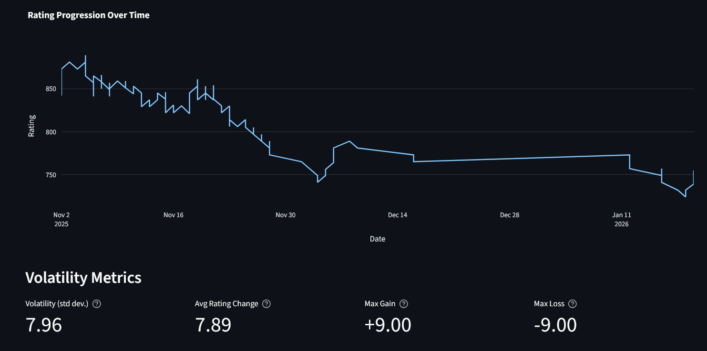
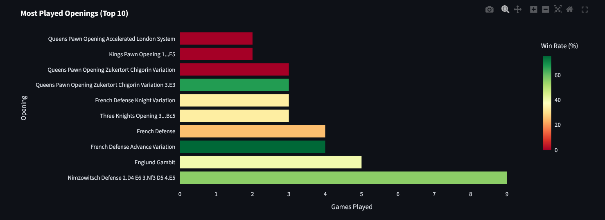
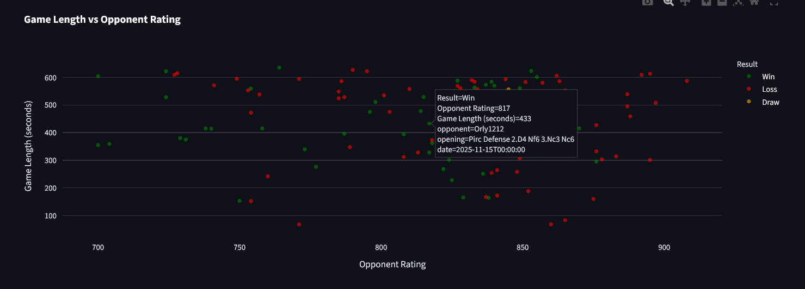
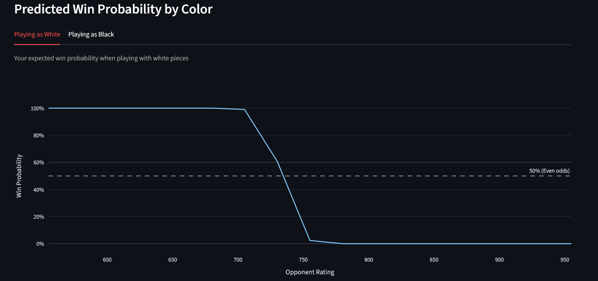

<!-- ---
classes: 
    - wide
    - dark-theme
title: "Building a Chess Analysis App (Part 2) - From Raw Games to Insight"
date: 2026-01-20
categories :
    - blog
tags: [streamlit]
# toc: true
# toc_label: "Table of Contents"
excerpt: "Structuring analysis and feature engineering on top of clean chess game data"
header:
#   overlay_image: /assets/images/innovation-sad.png
  overlay_filter: 0.5 # same as adding an opacity of 0.5 to a black background
#   caption: "Random picture"
--- -->

## Introduction (DONE)

Once game data has been fetched, validated, and stored, the next challenge is extracting insight systematically and reusably. In my [Chess Analysis](https://chess-analysis.streamlit.app/) project, the `ChessAnalyzer` class handles this step.

Where `ChessFetcher` focuses on getting data , the analyzer focuses on you guessed it ... analysis, by summarising performance, identifying patterns, and producing features for visualisation and modelling.

This post walks through the design and outputs of `ChessAnalyzer`, using my own account data as an example.

## Pipeline & Design (DONE)

The analyzer sits downstream of `ChessFetcher` and requires no API calls, file I/O, and operates purely on in-memory data. It prepares the data for plotting performed in the Chess Analysis application components.

```
ChessFetcher -> ChessAnalyzer -> Insights / Features / Plots
```

Where it inputs a pandas DataFrame from fetcher, and outputs:
* Aggregated statistics (scalars or compact tables)
* Transformed DataFrames suitable for plotting
* Feature matrices for machine learning

I designed these design principles when I was writing the `ChessAnalyzer` class:

* No external dependencies or side effects
* Precomputed shared features, calculated once at initialisation
* Composable outputs, in the form of dictionaries and DataFrames, not side effects

## Initialisation and Derived Features (DONE)

Derived features are computed once at initialisation to maintain consistency across analyses. Derived columns include:

| Feature             | Description                                |
| ------------------- | ------------------------------------------ |
| `rating_diff`       | user-rating − opponent-rating              |
| `opponent_category` | Lower / Similar / Higher rated (+/-50 Elo) |
| `game_num`          | Sequential game index                      |
| `result_category`   | Win / Loss / Draw labels                   |

Sample rows:

```
date        user_rating opponent_rating rating_diff opponent_category result_category
2025-09-15          463              255        208       Lower Rated          Win
2025-09-15          584              447        137       Lower Rated          Win
2025-09-15          672              561        111       Lower Rated          Win
2025-09-15          609              751       -142      Higher Rated         Loss
2025-09-15          678              637         41    Similar Rating          Win
```

## Overall Performance Statistics

High-level metrics to summarise overall performance, and provides a coarse summary of overall success and rating progression.

```python
stats = analyzer.get_overall_stats()
```

| Metric       | Value |
| ------------ | ----- |
| Total games  | 264   |
| Win rate     | 45.1% |
| Starting Elo | 463   |
| Current Elo  | 741   |
| Net change   | +278  |


## Rating Dynamics and Volatility

Tracks rating evolution and consistency.

**Trend over time**:

```python
trend = analyzer.get_rating_trend()
```
Whereas the rating volatility is the standard deviation of these changes.

```python
volatility = analyzer.get_rating_volatility()
```



## Opening Repertoire Analysis (Done)

The following identifies frequently played and effective openings. This shows your preffered repertoire for winning, and provides a good starting point for what you need to work on.

```python
openings = analyzer.get_opening_stats(top_n=10)
```



## Game Duration Analysis (Done)

By formatting the results as a time series against opponent ratings, it becomes easier to visualise the types of games played the user is likely to win in. To quantifiy correlation between game length and results.


```python
length_stats = analyzer.get_game_length_stats()
length_by_result = analyzer.get_game_length_by_result()
```



One interpretation could be that short games losses indicate early blunders, and long games suggest balanced or endgame-heavy play (you can see I am not good at long games).

## Machine Learning Feature Preparation (Done)

Prepares pre-game features for predictive models, avoiding leakage.

```python
X, y = analyzer.prepare_ml_features()
```

Uses the features: user rating, opponent rating, rating difference, and a binary indicator for playing White. With the target being 1 = win, 0 = loss/draw. Allowing for the win probability to be predicted as a regression problem.



## Conclusion (Done)

`ChessAnalyzer` converts cleaned chess game data into structured, actionable insights. It supports:

* Descriptive statistics
* Exploratory analysis
* Dashboard visualisation
* Machine learning workflows

By separating data acquisition from analysis, it forms the analytical core of the Chess Analysis app.
